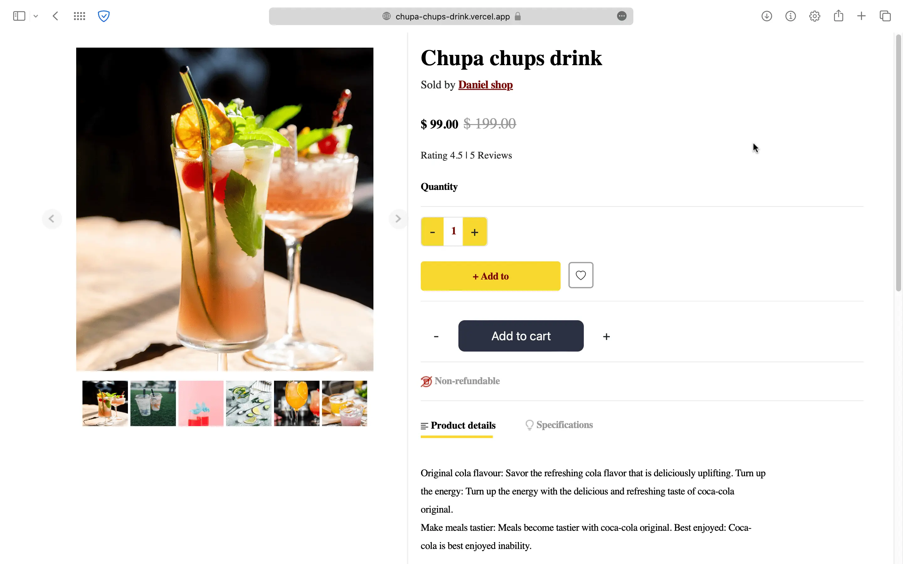

# Chupa Chups Drink

The github repository contains a responsive product page that has add-to-cart functionality, a slide show, and related products suggestions.


## Features

 - Add to cart
 - Images Slideshow
 - Related product suggestions


## Authors

- [@pankajbaliyan](https://www.github.com/pankajbaliyan)


## Contributing

Contributions are always welcome!

See `index.html` for ways to get started.

Please adhere to this project's `code of conduct`.


## Demo

https://chupa-chups-drink.vercel.app
<br><br>
https://pankajbaliyan.github.io/Chupa-chups-drink/


## Feedback

If you have any feedback, please reach out to us at pankajbaliyan90@gmail.com


## 🔗 Links
[](https://codewithpankaj.vercel.app)

[](https://www.linkedin.com/in/pankaj-kumar-90/)

## Lessons Learned

I learned many things while makeing this repository, i.e. how make animated "add to cart" button, making like button also a carousel of images, arrangement of fonts, matching the color pallets to full project, and many more....
## Run Locally

Clone the project

```bash
  git clone https://github.com/pankajbaliyan/Chupa-chups-drink.git
```

Go to the project directory

```bash
  cd my-project
```

Start code editor

```bash
  code .
```


## Screenshots




## Support

For support, email pankajbaliyan90@gmail.com or join our Slack channel.

